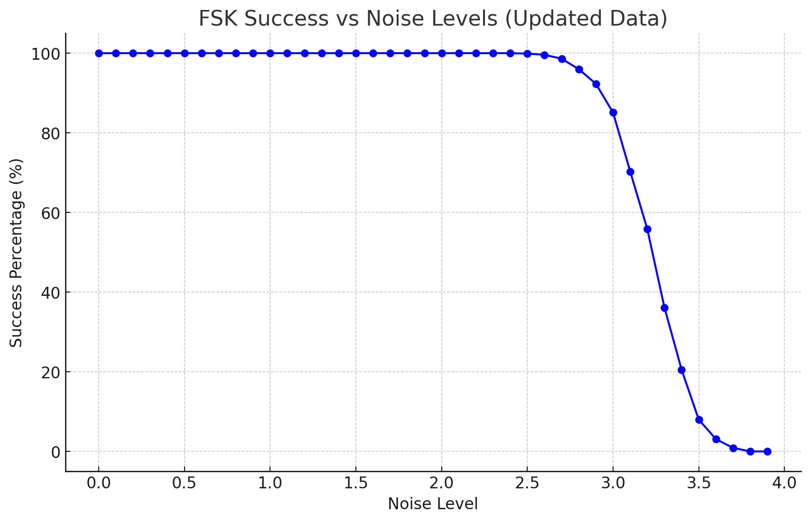

# AudioData C#
## Features
* Converting String into Audio.
* Hamming codes that supports 8 bits.
* Converting string into 8 bit arrays.
* Converting 8 bit arrays into a string.
* Handshakes to determine where data starts. (is kinda crucial for doing it cross devices)

## FSK
The FSK algoritm is really robust.
i've got a noise level generator that basically adds amplitude to the input audio and tests it.

this is how the curve of successrate looks like:

## QPSK

it is far from done, still looking for better ways of doing this.
If anyone has a better idea or any other frequencyshifts, please share!

# TLDR
i'm unsure if this works with any radios or any other devices.
Haven't had the time to test it. 
But if someone wants to take a crack at it, go ahead!

## Created by David Hornemark, 2024
