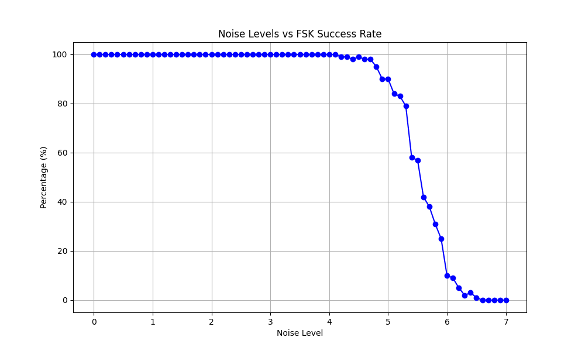
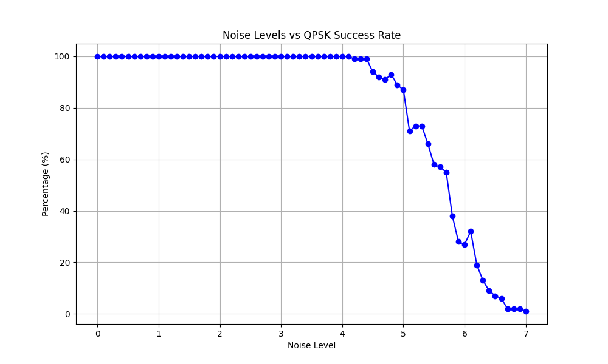

# AudioData C#
## Features
* Converting String into Audio.
* Hamming codes that supports 8 or 4 bits.
* Converting string into 8 bit arrays.
* Converting 8 bit arrays into a string.
* Handshakes to determine where data starts. (is kinda crucial for doing it cross devices)
* QPSK and FSK Modulation.

## FSK
The FSK algoritm is really robust.
i've got a noise level generator that basically adds amplitude to the input audio and tests it.

this is how the curve of successrate looks like:

## QPSK

The QPSK algoritm works really well.

The slight problem i have that both happens here and in FSK is that sometimes when it switches from 0 -> 1 or 0 -> 1 it plays both frequencies at the same time. 

i will need to look into it.

## TODO
* Making so that the program can take a float[] (or a double[]) instead of a file so it works without creating a file.
* Bug fixing QPSK Mod/Demod so it takes a minimum amount of time possible. Currently it takes ages!
* Fix QPSK BPS so it accounts for that it sends 2 bits per frequency.

## Notes
* The higher the sample rate the more "noise" it can withstand.
* Works across computers, Haven't tested higher BPS than 80 as per now

## Created by David Hornemark, 2024
