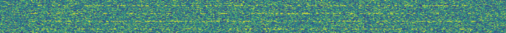

# AudioData C#
## !NOTES!
I have rewritten basically everything here in another project where i use this.
i'm thinking of pushing it here eventually and adding more encoding options, like Reed-Solomon
i'm thinking of also adding ASK and DM in the future aswell.

## Features
* Converting String into Audio.
* Hamming codes that supports 8 or 4 bits.
* Converting string into 8 bit arrays.
* Converting 8 bit arrays into a string.
* RS Encoding (Credit to: https://github.com/TanukiSharp/ReedSolomon)
* Handshakes to determine where data starts. (is kinda crucial for doing it cross devices)
* QPSK and FSK Modulation.
* Simple AES Crypto
* TBSK Modulation. (Credit to: https://github.com/nyatla/TBSKmodem)

## FSK
The FSK algoritm is really robust.
i've got a noise level generator that basically adds amplitude to the input audio and tests it.

this is how the curve of successrate looks like:

The spectrogram looks like this for FSK. where the higher frequency is 1 and lower 0.

When you up the noise. You see this. This is noise level 6. This was a success.

## QPSK

The QPSK algoritm works really well.

The slight problem i have that both happens here and in FSK is that sometimes when it switches from 0 -> 1 or 0 -> 1 it plays both frequencies at the same time. 

i will need to look into it.

The spectrogram looks like this for QPSK. each of the four frequencies represent 00, 01. 10, 11.

When you up the noise. You see this. This is noise level 5. This was a success.

## TODO
* Bug fixing QPSK Mod/Demod so it takes a minimum amount of time possible. Currently it takes ages!

## Notes
* I am not proud of how slow it is, its mostly the offset that makes it be really slow, i should probably look into a solution where the decoders themselves try to check for "high spots" where it is like 99.9999% confident that the bit is correct.

## Created by David Hornemark, 2025
